 
## 개발환경
- STS 버전 3.9.13.RELEASE
- 스프링 버전 4.3.8.RELEASE
- TOMCAT 9.0
- MYSQL 5.7.16
- MyBatis 3.4.1

## 데이터베이스관련 설정
- 게시판 테이블

    >create table tbl_board (
bno INT NOT NULL auto_increment,
title VARCHAR(200) NOT null,
content TEXT null,
writer varchar(50) not null,
regdate timestamp not null default now(),
viewcnt int default 0,
primary key tbl_board (bno)
 );

####
- 페이징 처리를 위해 충분한 양의 dummy 데이터 넣기

    >insert into tbl_board(title, content, writer) (select title, content, writer from tbl_board);

####

- 댓글 테이블

    >create table tbl_reply (
	rno int not null auto_increment,
    bno int not null default 0,
    replytext varchar(1000) not null,
    replyer varchar(50) not null,
    regdate timestamp not null default now(),
    updatedate timestamp not null default now(),
    primary key(rno)
 );

 ####

 - 외래키 추가

    >alter table tbl_reply add constraint fk_board foreign key(bno) references tbl_board(bno);

 ####

 - 댓글 개수 처리위해 tbl_board 테이블에 replycnt 컬럼을 추가
  
    >alter table tbl_board add column replycnt int default 0;

 ####

 - 게시물 조회화면에서 댓글 수 출력 위해 tbl_reply와 tbl_board 테이블의 댓글 숫자를 일치하게 변경한다.

    >update tbl_board set replycnt =
	(select count(rno)
    from
    tbl_reply
    where bno = tbl_board.bno)where bno >0;

####

- 첨부파일 테이블
    >create table tbl_attach (
	fullName varchar(150) not null,
    bno int not null,
    regdate timestamp default now(),
    primary key(fullName)
);

- 첨부파일 테이블 외래키 추가
    >alter table tbl_attach add constraint fk_board_attach
foreign key (bno) references tbl_board (bno);

## 협업방식

- 브랜치는 master- develop - feature 3개 브랜치를 사용한다.
- master는 실제 배포되는 브랜치이다. develop(개발 브랜치) 브랜치에서 테스트된 소스를 master에 merge하게 된다. feature 브랜치는 기능브랜치로서 개발자가 하나의 기능을 개발한 뒤 develop 브랜치에 merge하고 삭제한다.
- master에는 직접 푸시하지 않는다.
  
  ### 소스반영방법
  깃헙 > issue > 이슈번호
  ####
  이슈번호를 feature 브랜치 번호로 사용한다.
  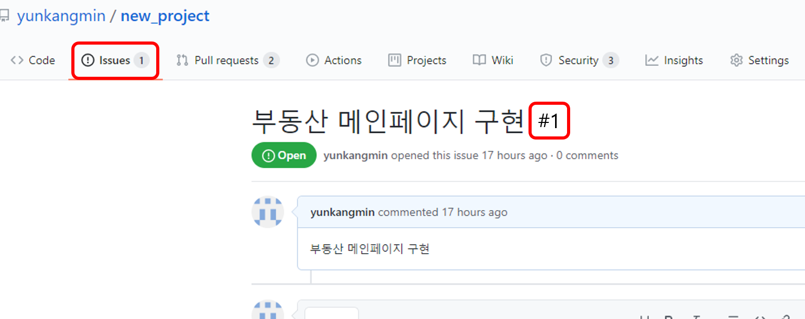

  STS에서 브랜치를 생성한다. feature/1에서 1은 위에 그림에서 이슈번호이다.
  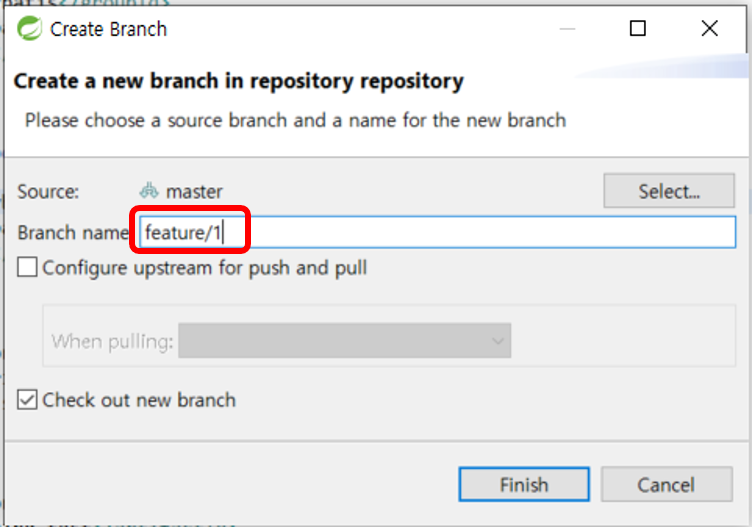

  feature/1 브랜치로 체크아웃이 되어 있는지 확인 후 아래와 같이 Test클래스를 생성하여 작업을 한다. issue에서 작성한 내용을 구현하면된다.
  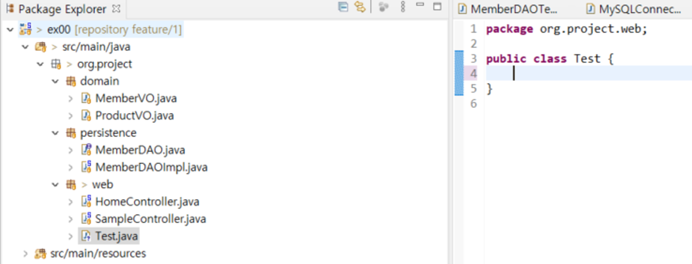

  푸시한다. 푸시하기 전에 코드에 오류가 없는지 검증해야 한다.
  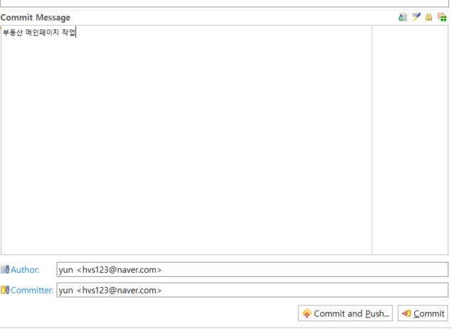
  
  깃헙에서 직접 Pull Request를 날린다.
  pull request는 기능개발 후 master 브랜치에 merge 요청을 하는 것이다. Colaborator에 소속(초대받은사람)되어 있다면 브랜치를 생성하고 push하면 pull request가 가능하다.
  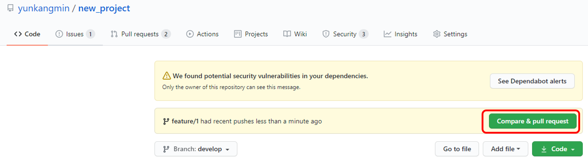
  
  base 브랜치가 develop으로 되어있는지 확인한 후 pull request를 날린다.
  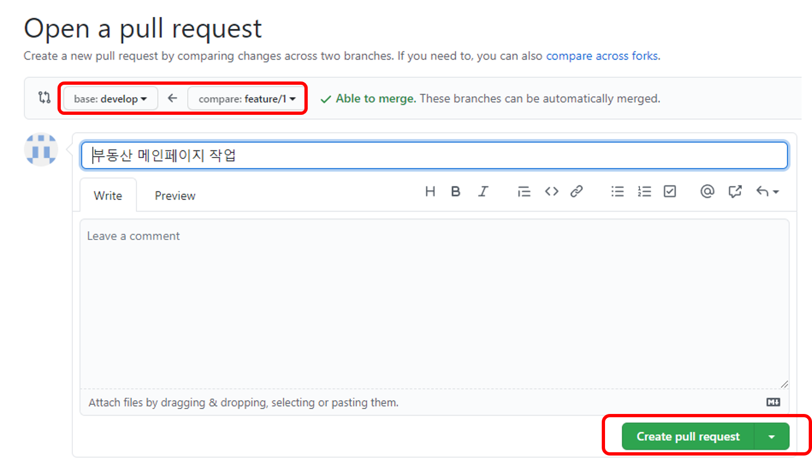

  다른 개발자가 pull request를 확인할 수 있으며 코멘트를 남길 수 있다.
  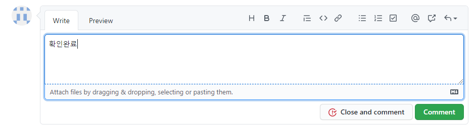

  pull request를 날린 후 merge하는 방법은 2가지가 있다.
  - 다른 개발자들에게 코드리뷰를 받고 본인이 직접 merge(초대된 개발자만 가능)
  - 저장소 주인이 merge
  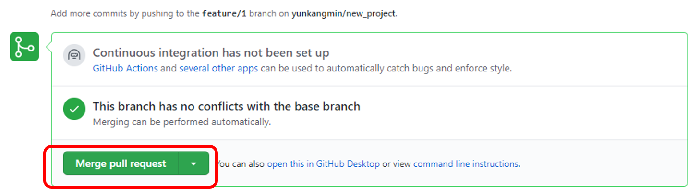

  merge 후 develop 브랜치로 변경하여 확인해보면 test.java가 생성된 것을 확인할 수 있다.
  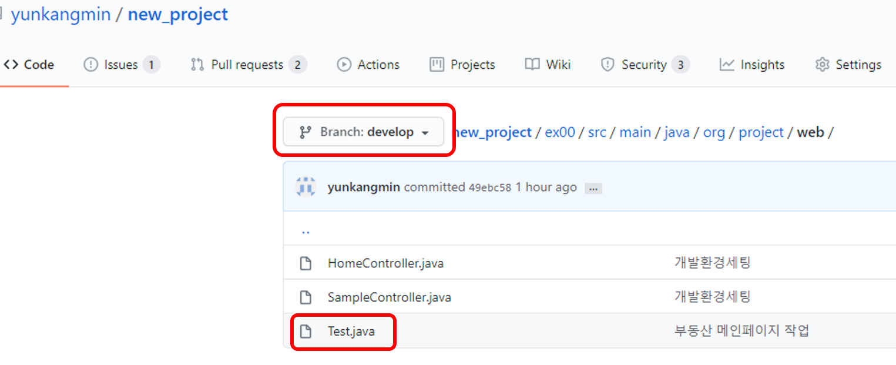

  STS로 와서 develop 브랜치로 체크아웃한 후 pull로 원격저장소에 소스내용을 로컬에도 반영하자. 현재 원격저장소에는 feature/1 브랜치가 develop 브랜치에 merge되었지만 로컬에는 merge되지 않았다.
  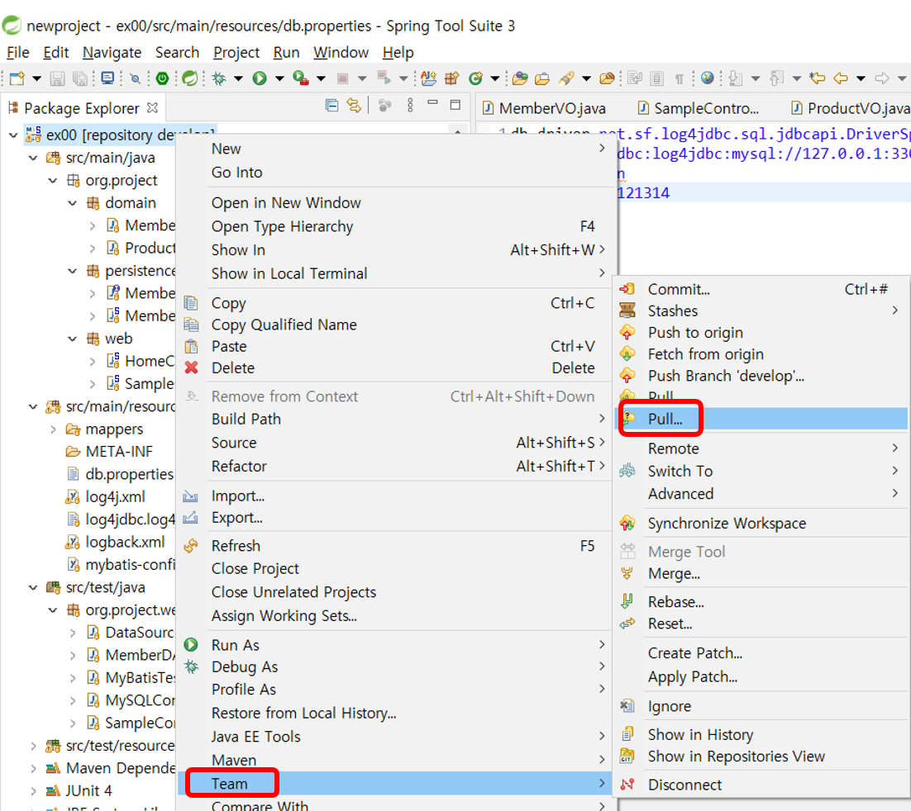
  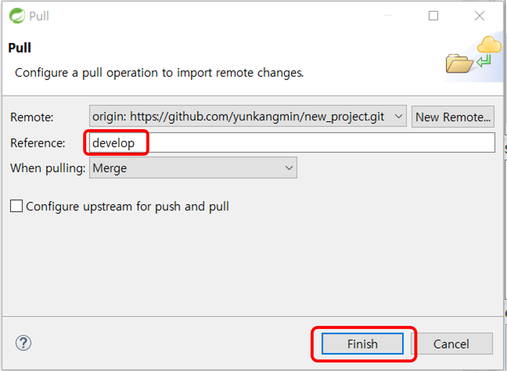
  pull 정상적으로 완료되면 아래와 같이 Test.java 파일이 받아진 것을 확인할 수 있다.
  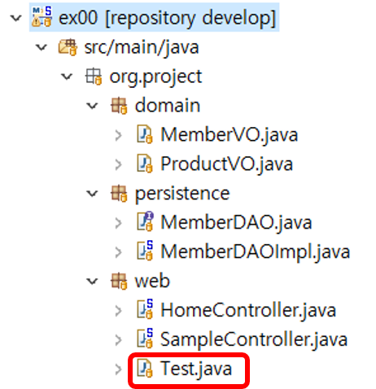
  
  feature/1 브랜치는 삭제한다.
  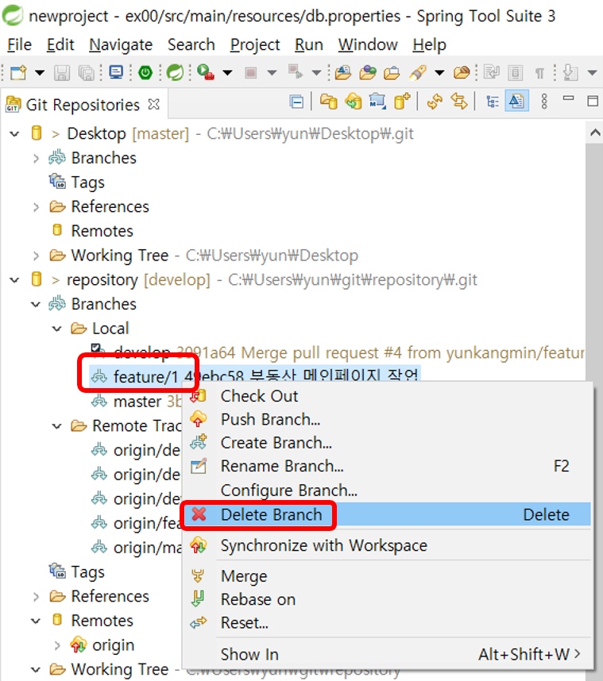   
  ## 정리
  위와 같이 개발하면 개발자들은 각자의    브랜치에서 작업을 하고 최종적으로는 develop 브랜치에 개발자들의 소스가 모두 합쳐져있게 된다.
  ###
  프로젝트 제출 시 원격저장소 주인은 develop 브랜치가 정상적으로 작동한다면 master 브랜치에 merge하여 프로젝트를 제출하면 된다.

